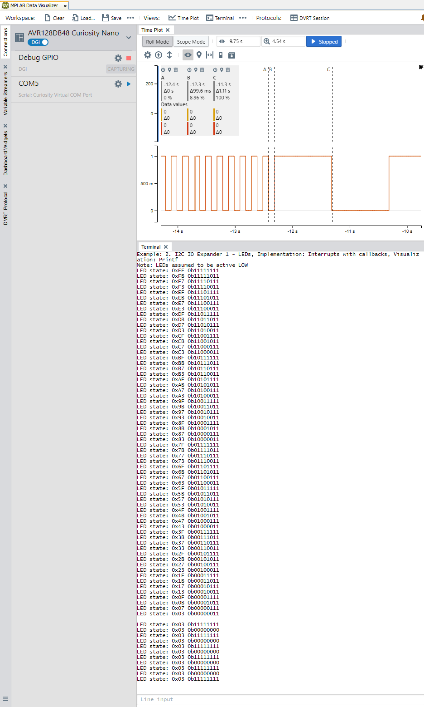
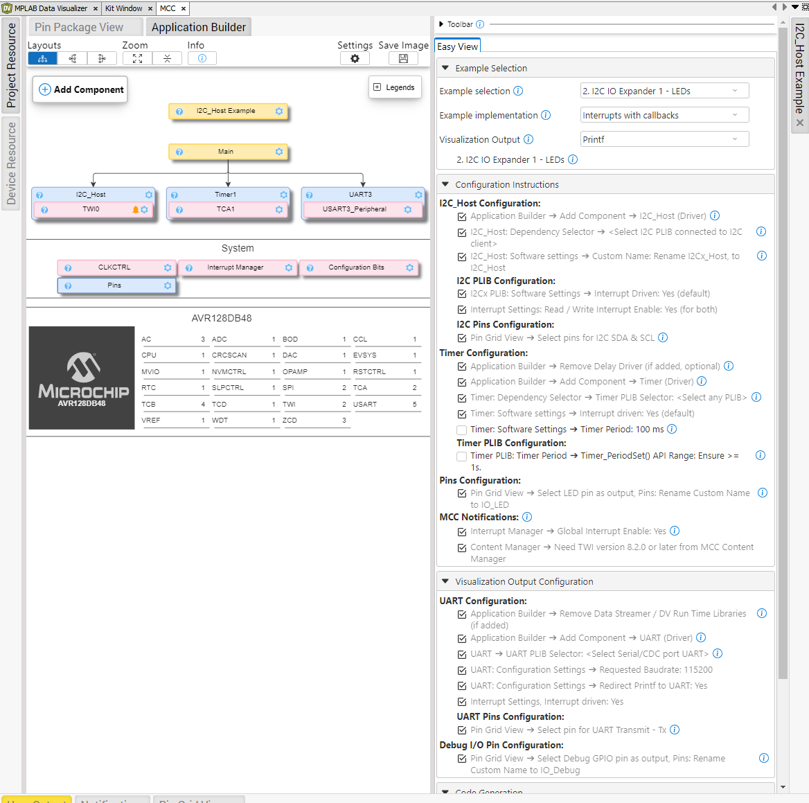
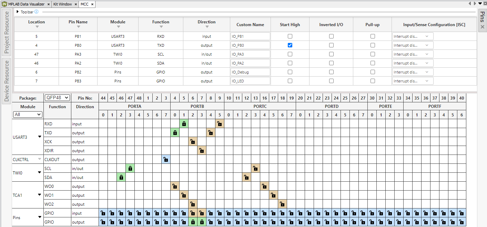
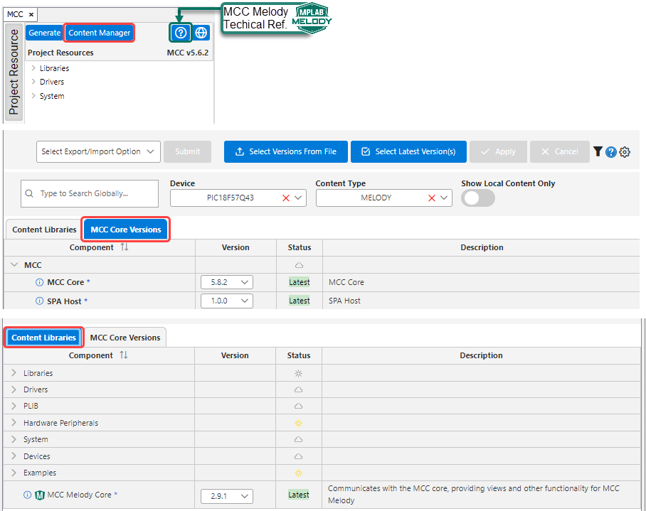

<!-- MPAE-19437 Please do not change this logo with link -->

<a target="_blank" href="https://www.microchip.com/" id="top-of-page">
   <picture>
      <source media="(prefers-color-scheme: light)" srcset="images/mchp_logo_light.png" width="350">
      <source media="(prefers-color-scheme: dark)" srcset="images/mchp_logo_dark.png" width="350">
      
   </picture>
</a>

# AVR128DB48 I2C_Host Example Component for CNano Explorer: I/O Expander 1 LEDs (Callbacks, Printf)

The [I2C Host IO Expander 1 - LEDs Example](https://onlinedocs.microchip.com/v2/keyword-lookup?keyword=I2C.HOST.EX.RUNNING.I2C.HOST.IOEXPANDER1.LEDS&version=latest&redirect=true "I2C Host IO Expander 1 - LEDs Example"
), of the [MCC Melody I2C Example Component (for the Curiosity Nano Explorer)](https://onlinedocs.microchip.com/v2/keyword-lookup?keyword=I2C.HOST.EXAMPLE.COMPONENT&version=latest&redirect=true "MCC Melody I2C Example Component for the Curiosity Nano Explorer"
), is used here in the Callbacks implementation, with the Printf visualization. 

The example implements an LED chaser, incrementing the binary number on the lower six LEDs every 100 ms. Once the six active-low LEDs are all on, the pattern changes to toggle all eight LEDs every second.

The callbacks implementation uses the Timer driver. To handle the change from 100 to 1000 ms, the timer period is changed and a new timer callback is used. The hex and binary values of the I/O expander pins are displayed as a printf message over the Universal Asynchronous Receiver and Transmitter (UART).

## Operation
When running the application using the [MPLAB® Data Visualizer](https://www.microchip.com/en-us/tools-resources/debug/mplab-data-visualizer "MPLAB® Data Visualizer"), something similar should be displayed:

**Note:** On the time plot, the deltas for the B and C columns are 99.6 ms and 1.11 s, respectively. The 100 ms difference, is due to the positioning of the cursor. 

## Setup
The image below outlines the complete MPLAB Code Configurator (MCC) Melody configuration, including all the selected tasks implemented in this example, as seen in the MCC Melody Builder.

<!-- This is where the introduction to the example goes, including mentioning the peripherals used -->

## MCC Melody Example Components
Example Components are a tight integration of learning material directly into MCC. This allows users to conveniently place the configuration instructions side-by-side to the components they are configuring. For more information, refer to the [MCC Melody Example Components](https://onlinedocs.microchip.com/v2/keyword-lookup?keyword=MCC.MELODY.EXAMPLES&version=latest&redirect=true) introduction. 

## Related Documentation

- [MCC Melody I2C Example Component (for the Curiosity Nano Explorer)](https://onlinedocs.microchip.com/v2/keyword-lookup?keyword=I2C.HOST.EXAMPLE.COMPONENT&version=latest&redirect=true "MCC Melody I2C Example Component for the Curiosity Nano Explorer")
- [MCC Melody Design Patterns for Control Flow](https://onlinedocs.microchip.com/g/GUID-7CE1AEE9-2487-4E7B-B26B-93A577BA154E "MCC Melody Design Patterns for Control Flow")

- [Curiosity Nano Explorer User Guide](https://ww1.microchip.com/downloads/aemDocuments/documents/MCU08/ProductDocuments/UserGuides/CNANO-Explorer-UserGuide-DS50003716.pdf "Curiosity Nano Explorer Users Guide")

- [AVR128DB48 Data Sheet](https://ww1.microchip.com/downloads/en/DeviceDoc/AVR128DB28-32-48-64-DataSheet-DS40002247A.pdf "AVR128DB48 Data Sheet")

## Software Used
- [MPLAB® X IDE](https://www.microchip.com/en-us/development-tools-tools-and-software/mplab-x-ide) v6.25 or newer 
- [MPLAB® XC8](https://www.microchip.com/en-us/tools-resources/develop/mplab-xc-compilers/xc8) v3.00 or newer

- [MPLAB® Code Configurator](https://www.microchip.com/en-us/tools-resources/configure/mplab-code-configurator) (MCC) Plug-in Version v5.6.2 or newer (*Tools>Plugins>Installed*, search: "MCC")
- [MPLAB® Data Visualizer](https://www.microchip.com/en-us/tools-resources/debug/mplab-data-visualizer) Plug-in Version v1.4.1926 or newer (*Tools>Plugins>Installed*, search: "Data Visualizer")
- MCC Melody I2C_Host Example Component for the Curiosity Nano Explorer 1.0.0 or newer
- MCC Core v5.8.2 or newer 
- Single Page Application (SPA) Host v1.0.0 or newer
- MCC Melody Core v2.9.1 or newer

Open the MCC Content Manager  to verify the MCC Core and MCC Melody Core versions. 

 

## Hardware Used
- AVR128DB48 Curiosity Nano [(EV35L43A)](https://www.microchip.com/en-us/development-tool/EV35L43A)
- Curiosity Nano Explorer [(EV58G97A)](https://www.microchip.com/en-us/development-tool/EV58G97A)

